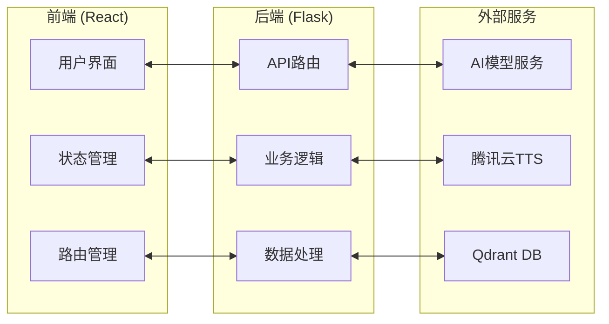

# AIGC - AI Generated Content 智能内容生成平台

## 项目简介

AIGC是一个基于React + Flask的智能内容生成平台，支持多AI角色对话、语音识别、语音合成、向量数据库存储等功能。用户可以与不同的AI角色进行对话，支持文本和语音输入，并提供丰富的交互体验。

## 功能特性

- 🤖 **多AI角色对话**：支持多个预设AI角色，每个角色具有独特的个性和专业领域
- 🎙️ **语音识别**：基于Vosk的中文语音识别，支持实时语音输入
- 🔊 **语音合成**：集成腾讯云TTS，支持多种音色和语音参数调节
- 💾 **向量数据库**：使用Qdrant进行对话历史的向量化存储和检索
- 🎨 **现代化UI**：基于React + Bootstrap的响应式界面设计
- 📱 **移动端适配**：支持桌面端和移动端的完整体验
- ⚙️ **个性化设置**：支持TTS参数调节、自动播放等个性化配置

## 项目介绍
https://www.bilibili.com/video/BV1hdnZzXEDP

## 快速开始

### 环境要求

- **Node.js**: 16.0+ 
- **Python**: 3.8+
- **操作系统**: Windows/Linux/macOS

### 安装步骤

#### 1. 克隆项目
```bash
git clone https://github.com/132344/AIGC.git
cd AIGC
```

#### 2. 配置后端环境

```bash
# 创建Python虚拟环境（推荐）
python -m venv .venv

# 激活虚拟环境
# Windows:
.venv\Scripts\activate
# Linux/macOS:
source .venv/bin/activate

# 安装Python依赖
pip install -r requirements.txt
```

#### 3. 配置前端环境

```bash
cd frontend
npm install
```

#### 4. 配置文件设置

复制并编辑配置文件：
```bash
# 在项目根目录下编辑 config 并添加后缀.yaml
```

**重要配置项说明：**
- `api.Qiniu.api_key`: 七牛云API密钥  文本对话模型
- `api.siliconflow.api_key`: 硅基流动 API密钥  嵌入模型
- `txyun`: 腾讯云TTS服务配置  文字转语音

### 运行程序

#### 分别启动

**启动后端服务：**
```bash
# 在项目根目录下
python python/app.py
```
后端服务将在 `http://localhost:5000` 启动

**启动前端服务：**
```bash
# 在frontend目录下
cd frontend
npm start
```
前端服务将在 `http://localhost:3000` 启动

## 架构设计

### 整体架构



### 技术栈

#### 前端技术栈
- **React 19.1.1**: 用户界面框架
- **React Router 7.9.3**: 前端路由管理
- **Bootstrap 5.3.8**: UI组件库和响应式布局
- **Bootstrap Icons**: 图标库
- **Axios 1.12.2**: HTTP客户端
- **React Markdown**: Markdown渲染支持

#### 后端技术栈
- **Flask 2.3.3**: Web应用框架
- **Flask-CORS**: 跨域资源共享支持
- **PyYAML**: 配置文件解析
- **Requests**: HTTP请求库
- **Vosk 0.3.45**: 语音识别引擎
- **PyAudio**: 音频处理
- **Qdrant Client**: 向量数据库客户端
- **腾讯云SDK**: TTS语音合成服务

### 数据流架构

```
用户输入 → 前端组件 → API请求 → 后端路由 → 业务逻辑 → 外部服务 → 数据处理 → 响应返回 → 前端更新
```

## 模块规格与分工

### 开发人员
```
于嘉：完成前后端所有任务的开发
```
### 前端模块 (`frontend/src/`)

#### 核心组件模块

**1. App.js**
- **功能**: 应用主入口，路由配置
- **职责**: 全局路由管理、应用初始化
- **依赖**: React Router

**2. HomePage.js + HomePage.css**
- **功能**: 首页角色选择界面
- **职责**: 
  - 角色列表展示
  - 角色搜索功能
  - 角色卡片交互
- **API调用**: `GET /api/roles`

**3. ChatPage.js**
- **功能**: 聊天页面主容器
- **职责**:
  - 聊天状态管理
  - 组件协调
  - 消息流控制
  - 设置管理
- **子组件**: Sidebar, ChatWindow, SettingsModal

**4. Sidebar.js**
- **功能**: 侧边栏组件
- **职责**:
  - 角色信息展示
  - 聊天历史管理
  - 上下文切换
  - 侧边栏收起/展开
- **API调用**: `GET /api/contexts`, `POST /api/contexts`, `DELETE /api/contexts`

**5. ChatWindow.js**
- **功能**: 聊天窗口主体
- **职责**:
  - 消息列表展示
  - 消息输入处理
  - 语音录制功能
  - 消息发送控制
- **API调用**: `POST /api/chat`, `POST /api/asr`

**6. Message.js + Message.css**
- **功能**: 单条消息组件
- **职责**:
  - 消息内容渲染
  - Markdown支持
  - TTS播放控制
  - 消息样式处理

**7. SettingsModal.js**
- **功能**: 设置弹窗
- **职责**:
  - TTS参数配置
  - 用户偏好设置
  - 设置数据持久化

#### 服务模块

**8. services/api.js**
- **功能**: API服务封装
- **职责**:
  - HTTP请求统一管理
  - 错误处理
  - 请求拦截器
- **主要方法**:
  - `getRoles()`: 获取角色列表
  - `getContexts()`: 获取上下文列表
  - `sendMessage()`: 发送消息
  - `asr()`: 语音识别
  - `tts()`: 语音合成

### 后端模块 (`python/`)

#### 核心业务模块

**1. app.py**
- **功能**: Flask应用主入口
- **职责**:
  - API路由定义
  - 服务初始化
  - 错误处理
  - CORS配置
- **主要路由**:
  - `/api/roles`: 角色管理
  - `/api/chat`: 聊天接口
  - `/api/asr`: 语音识别
  - `/api/tts`: 语音合成
  - `/api/contexts`: 上下文管理

**2. QiniuAI.py**
- **功能**: AI服务核心业务逻辑
- **职责**:
  - AI模型调用
  - 消息处理
  - 上下文管理
  - 向量数据库操作
- **主要类**:
  - `QiniuAI`: 主业务类
  - 集成Qdrant向量数据库
  - 支持多模型切换

**3. wzyy.py (TTS模块)**
- **功能**: 语音合成服务
- **职责**:
  - 腾讯云TTS API调用
  - 音频文件生成
  - 语音参数配置
- **主要类**:
  - `TTSSynthesizer`: TTS合成器
  - 支持多种音色和参数

**4. yywz_bd.py (ASR模块)**
- **功能**: 语音识别服务
- **职责**:
  - Vosk语音识别
  - 音频数据处理
  - 识别结果返回
- **主要类**:
  - `VoskRecognizer`: 语音识别器
  - 支持中文语音识别

**5. Qdrant.py**
- **功能**: 向量数据库管理
- **职责**:
  - 向量数据存储
  - 相似度检索
  - 数据库连接管理
- **主要类**:
  - `QdrantManager`: 数据库管理器
  - 支持向量化存储和检索

**6. text.py**
- **功能**: 文本处理工具
- **职责**:
  - 文本预处理
  - 工具函数集合
- **主要类**:
  - `Test`: 文本处理工具类

### 配置模块

**config.yaml**
- **功能**: 系统配置文件
- **包含配置**:
  - API密钥配置
  - 模型参数配置
  - 数据库连接配置
  - TTS服务配置
  - 角色映射配置

### 数据库设计

#### Qdrant向量数据库
- **集合结构**: 按角色分离存储
- **向量维度**: 1024维
- **距离算法**: Cosine相似度
- **数据类型**: 对话历史向量化存储

### API接口规范

#### 聊天接口
```
POST /api/chat
Content-Type: application/json

{
  "message": "用户消息",
  "role": "角色ID", 
  "context": "上下文ID",
  "input_type": "text|voice"
}

Response:
{
  "response": "AI回复",
  "emotion": "情感标识",
  "status": "success|error"
}
```

#### 语音识别接口
```
POST /api/asr
Content-Type: multipart/form-data

audio: 音频文件

Response:
{
  "text": "识别结果",
  "status": "success|error"
}
```

#### TTS接口
```
POST /api/tts
Content-Type: application/json

{
  "text": "待合成文本",
  "voice": 音色ID,
  "speed": 语速,
  "volume": 音量
}

Response: 音频文件流
```

## 开发指南

### 开发环境设置

1. **代码规范**: 使用Prettier进行代码格式化
2. **Git工作流**: 建议使用feature分支开发
3. **测试**: 前端使用Jest，后端建议添加pytest

### 常见问题

**Q: 语音识别不工作？**
A: 检查Vosk模型文件是否正确下载到 `vosk-model-small-cn-0.22/` 目录

**Q: TTS服务报错？**
A: 检查腾讯云API密钥配置是否正确

**Q: 前端无法连接后端？**
A: 确认后端服务已启动且端口5000未被占用

### 贡献指南

1. Fork项目
2. 创建feature分支
3. 提交代码
4. 创建Pull Request

## 许可证

本项目采用MIT许可证，详见 [LICENSE.txt](LICENSE.txt) 文件。

## 联系方式

- 项目地址: https://github.com/132344/AIGC
- 问题反馈: 请在GitHub Issues中提交

---

**注意**: 使用前请确保已正确配置所有API密钥和服务凭证。
